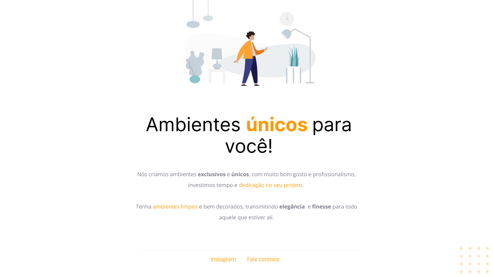

<h1 align="center"> Desafio 01 </h1>

Primeiro estágio Explorer pra praticar conceitos basícos de HTML e CSS  

  <a href="#-tecnologias">Tecnologias</a>&nbsp;&nbsp;&nbsp;|&nbsp;&nbsp;&nbsp;
  <a href="#-projeto">Projeto</a>&nbsp;&nbsp;&nbsp;|&nbsp;&nbsp;&nbsp;
  <a href="#-layout">Layout</a>&nbsp;&nbsp;&nbsp;

  

 

  

## 🚀 Tecnologias

Esse projeto foi desenvolvido com as seguintes tecnologias:

- HTML e CSS
- Figma
- Git e Github

## 💻 Projeto

Projeto para o aprendizado de HTML e CSS

## 🔖 Layout

Você pode visualizar o layout do projeto através [DESSE LINK](https://www.figma.com/file/h7onAy5EnUs5HMySgT3Fl2/Explorer---Projeto-01-(Copy)-(Copy)?node-id=0%3A1&t=nkS54fB0q5AqJhEo-0). É necessário ter conta no [Figma](https://figma.com) para acessá-lo.

---

Feito com ♥ by Marlison Mourão