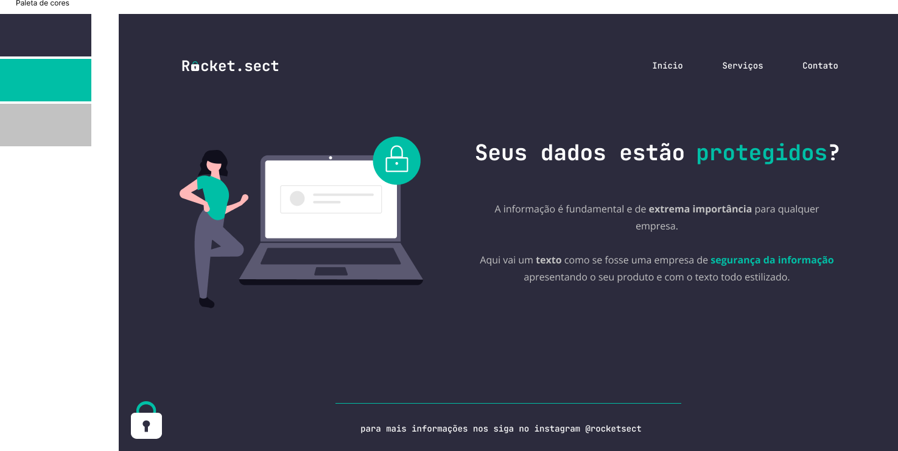

<h1 align="center"> Desafio 02 </h1>

Segundo Desafio Explorer pra praticar conceitos basícos de HTML e CSS  

  <a href="#-tecnologias">Tecnologias</a>&nbsp;&nbsp;&nbsp;|&nbsp;&nbsp;&nbsp;
  <a href="#-projeto">Projeto</a>&nbsp;&nbsp;&nbsp;|&nbsp;&nbsp;&nbsp;
  <a href="#-layout">Layout</a>&nbsp;&nbsp;&nbsp;

  

 

  

## 🚀 Tecnologias

Esse projeto foi desenvolvido com as seguintes tecnologias:

- HTML e CSS
- Figma
- Git e Github

## 💻 Projeto

Segundo desafio proposto pelo explorer da Rocketseat

## 🔖 Layout

Você pode visualizar o layout do projeto através [DESSE LINK](figma.com/file/euX4U7htMC0nwjszTuY3C7/Explorer-(Copy)?node-id=0%3A1). É necessário ter conta no [Figma](https://figma.com) para acessá-lo.

---

Feito com ♥ by Marlison Mourão