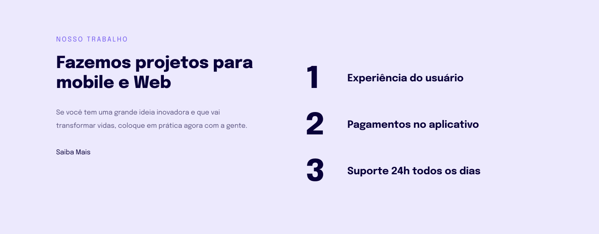
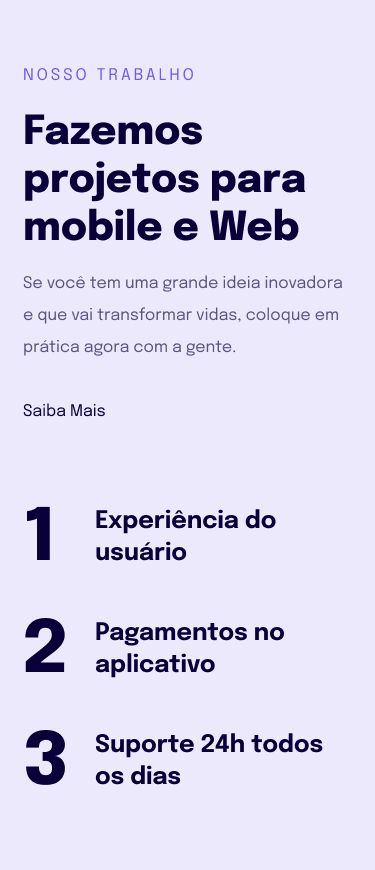

<h1 align="center"> Projeto 04 </h1>

Quarto estágio Explorer pra praticar conceitos basícos de HTML e CSS  

  <a href="#-tecnologias">Tecnologias</a>&nbsp;&nbsp;&nbsp;|&nbsp;&nbsp;&nbsp;
  <a href="#-projeto">Projeto</a>&nbsp;&nbsp;&nbsp;|&nbsp;&nbsp;&nbsp;
  <a href="#-layout">Layout</a>&nbsp;&nbsp;&nbsp;

  

 

  
   

## 🚀 Tecnologias

Esse projeto foi desenvolvido com as seguintes tecnologias:

- HTML e CSS
- Figma
- Git e Github

## 💻 Projeto

Projeto para o aprendizado de HTML e CSS

## 🔖 Layout

Você pode visualizar o layout do projeto através [DESSE LINK](https://www.figma.com/file/v53lxlXoxtg9fjTVkjkXRi/Explorer-Stage-03-Projeto-02-(Copy)?node-id=203%3A412&t=C2PWxHYgu1VBSQAF-0). É necessário ter conta no [Figma](https://figma.com) para acessá-lo.

---

Feito com ♥ by Marlison Mourão